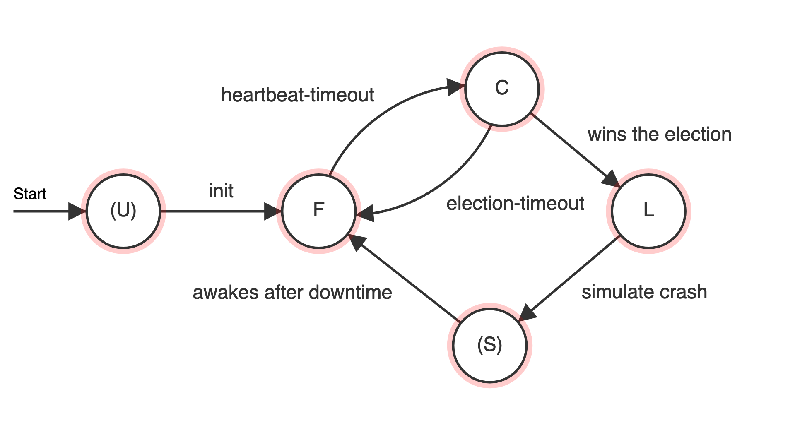

# (Prototype) Raft Consensus Algorithm in Scala

**Protoype Raft Consensus Algorithm in Scala**


Tested on ``macOs 10.15.2`` with ``openjdk64-11.0.2`` and ``sbt 1.3.3``

[](http://www.apache.org/licenses/LICENSE-2.0.txt)


Test line-coverage: 88,11% ([12-30-2019](./docImg/test-report-12-30-2019.zip))

Author: [Maximilian Bundscherer](https://bundscherer-online.de)

## Let's get started

- [sbt](https://www.scala-sbt.org/) and [openjdk64-11.0.2](https://jdk.java.net/archive/) are required to build and run project

- Run with: ``sbt run`` (see ***What happens in normal run?*** below)
- Test with: ``sbt test`` (or see ci-tests in GitHub-Actions-CI-Pipeline) (see ***What happens in test run?*** below)
- Generate test-coverage-html-report with: ``sbt jacoco``

### Used dependencies

- [akka actors](https://doc.akka.io/docs/akka/current/actors.html): Actor model implementation (scala/java).
- [scalactic](http://www.scalactic.org/): Test kit for scala.
- [sbt-jacoco](https://github.com/sbt/sbt-jacoco): SBT plugin for generating coverage-reports.

### What is implemented?

- RaftNode as Finite-state machine (**FSM**) with **key-value storage**

    - ``(Uninitialized)``: Not initialized
    - ``Follower`` (Default behavior): Waiting for heartbeats from leader-node with hashCode from data. If local stored data's hashCode is not equal to leader-node data's hashCode the node synchronizes with leader-node. If there is no heartbeat from leader-node in configured randomized interval received, the node is changing to candidate-behavior. 
    - ``Candidate``: The candidate requests votes from all followers and votes for himself. If he gets the majority in configured interval, he become the leader. If not he become follower again.
    - ``Leader``: The leader is sending continuous heartbeats to all followers with hashCode from his stored data. The leader is the only node that is allowed to write data.
    - ``(Sleep)``: Is used for simulating leader-crashes (triggered by crashIntervalHeartbeats in normal run or by SimulateLeaderCrash in test run). In this behavior the node does not respond to non-debug-messages. After configured downtime the node is changing to follower-behavior.
    


#### Configuration

There are two configurations:

- ``./src/main/resources/application.conf`` used for normal run
- ``./src/test/resources/application.conf`` used for test run
    
```
akka {

    # Log Level (DEBUG, INFO, WARNING, ERROR)
    loglevel = "DEBUG"

}

raftPrototype {

    # Election Timer Min (Seconds)
    electionTimerIntervalMin = 2

    # Election Timer Max (Seconds)
    electionTimerIntervalMax = 3

    # Heartbeat Timer Interval (Seconds)
    heartbeatTimerInterval = 1

    # Raft Nodes (Amount)
    nodes = 5

    # Crash Interval (auto simulate crash after some heartbeats in LEADER behavior)
    crashIntervalHeartbeats = 10

    # Sleep downtime (Seconds) (after simulated crash in SLEEP behavior)
    sleepDowntime = 8

}
```

### What happens in normal run?

All nodes starts in follower behavior (some of them will change their behavior to candidate) and will elect the first leader. After some (configured) heartbeats from leader, the leader is simulating crash and is "sleeping" for configured downtime. The next leader will be elected.

This happens again and again and again... till you stop the program or the earth is going to overheat ;)

Data exchange (write data trough leader to followers) will be tested in test run.

### What happens in test run?

1. Leader election
2. Write data trough leader to followers
3. Get back data from all nodes
4. Simulate leader crash
5. New leader election
6. Write data trough leader to followers
7. Get back data from all nodes


The ***integration-test*** is well documented - it's self explaining:

- ``./src/test/scala/de/maxbundscherer/scala/raft/RaftServiceTest.scala``

## Talk about ...

- ... enums in scala
- ... typed akka actors (and service layer alternative)
- ... fsm in akka actor
- ... difference between ``scheduleWithFixedDelay`` and ``scheduleAtFixedRate`` in akka